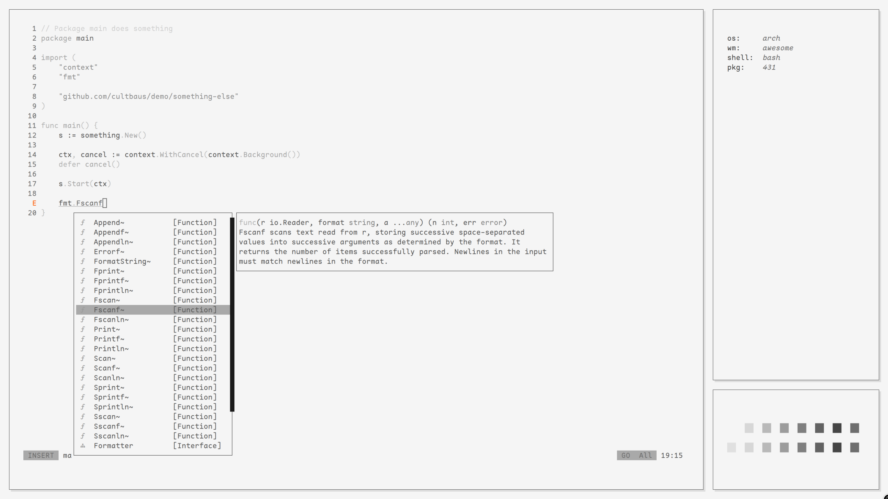
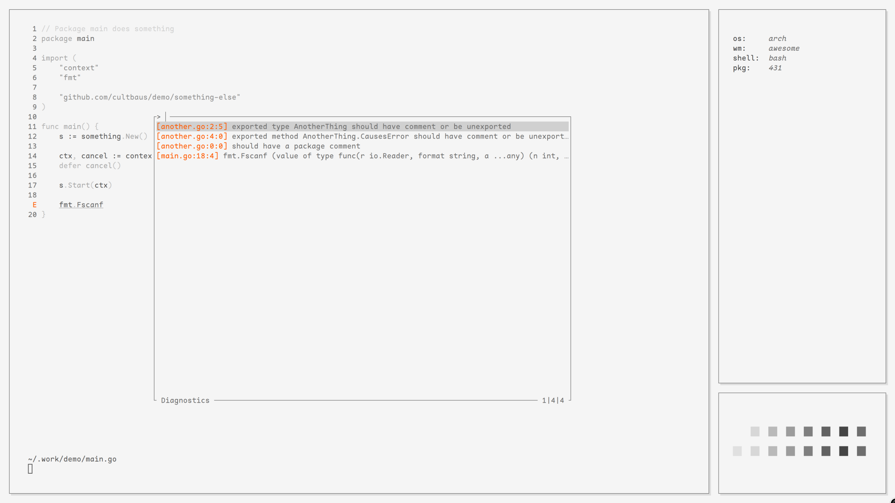

# nvim

Neovim configuration, mostly assumes you are building from Nightly fairly often which is `0.10` at the time of writing. Quite a few of the plugins I use are from [mini.nvim][1] and I highly recommend checking it out, and keeping an eye on upcoming releases.

`Setup` and `Configuration` are logically separate just because I think that is the direction plugins are going to take with all the commotion lately around `.setup { }` and I am planning for the future.

<div align="center">
    
    
</div>

### Quick start

1. Remove or backup your current configuration

```sh
    rm -rf ~/.config/nvim
    rm -rf ~/.local/share/nvim
    rm -rf ~/.local/site/nvim
```

2. Clone the repo, and place in `~/.config`

### Features

- Full LSP with auto-completion
- Git files, live grep, and diagnostic buffer-based navigation menus from [mini.pick][1]
- Vim-like file tree for quick directory/file creation from [mini.files][1]
- Automatic tooling and language server installation (see `:h Mason` for any errors)
- Eager linting where applicable
- Format on save

### Thanks

Thanks to [folke][3] and [echasnovski][4] for their incredible work in the plugin space, the former of which provided a foundation for me to steal quite a few configuration from the remarkable [LazyVim][5] project, the latter providing nearly half the core plugins which my configuration is now based upon.

### Colors

Color theme is Noctu which passes your terminal theme into Nvim. I'm using a modified version of [pap][2] to set my color theme, which is based on gruvxbox-material.

[1]: https://github.com/echasnovski/mini.nvim
[2]: https://github.com/fehawen/pap
[3]: https://github.com/folke
[4]: https://github.com/echasnovski
[5]: https://www.lazyvim.org/
